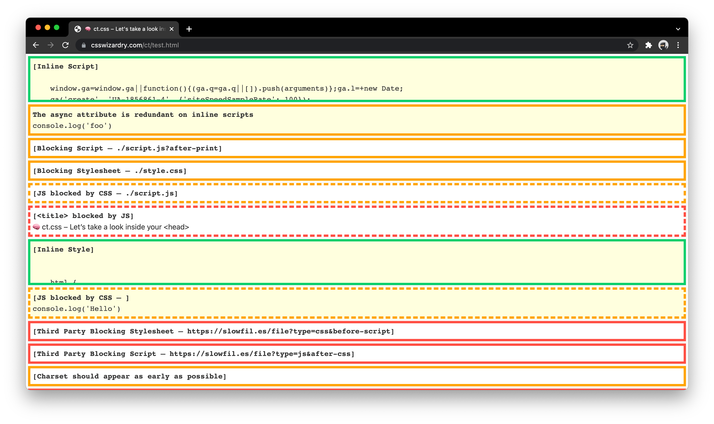
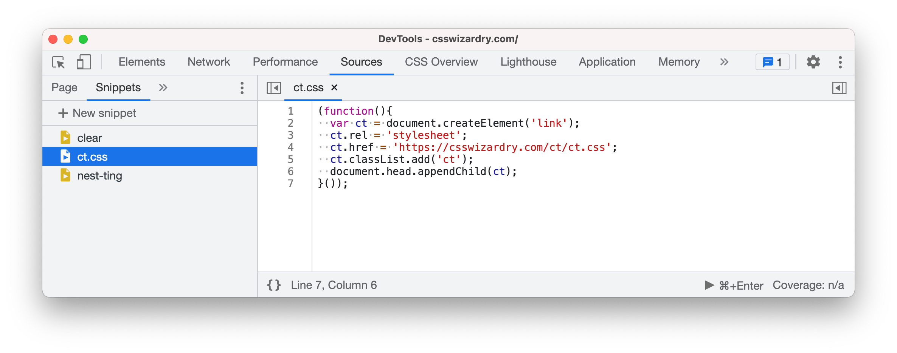

# `ct.css` – Let’s take a look inside your `<head>`

> Computed tomography of the head uses a series of X-rays in a CT scan of the
> head…  
> — [wikipedia.org/Computed_tomography_of_the_head](https://en.wikipedia.org/wiki/Computed_tomography_of_the_head)

Your `<head>` is the single biggest render-blocking part of your page—ensuring
it is well-formed is critical. `ct.css` is a CSS diagnostic snippet that exposes
potential performance issues in your page’s `<head>` tags.

## Example Output



## Simple Usage

Paste this anywhere in your HTML:

```html
<link rel="stylesheet" href="https://csswizardry.com/ct/ct.css" class="ct" />
```

## Bookmarklet

Drag and drop the following link to your bookmarks bar: <a href="javascript:(function(){ var ct = document.createElement('link'); ct.rel = 'stylesheet'; ct.href = 'https://csswizardry.com/ct/ct.css'; ct.classList.add('ct'); document.head.appendChild(ct); }());;">ct.css</a>.

## Chrome Snippet



[_Run Snippets Of JavaScript On Any Page With Chrome DevTools_](https://developers.google.com/web/tools/chrome-devtools/javascript/snippets)

```
(function(){
  var ct = document.createElement('link');
  ct.rel = 'stylesheet';
  ct.href = 'https://csswizardry.com/ct/ct.css';
  ct.classList.add('ct');
  document.head.appendChild(ct);
}());
```

## Limitations

* **Non-matching `media` types:** Currently, `ct.css` only takes print
  stylesheets into account. This means that you may experience false-positives
  for other non-blocking stylesheets.
* **Injected `script` elements:** `ct.css`, as with all CSS, acts against the
  DOM and not the HTML. As such, injected `script` elements will be falsely
  flagged as blocking.
  * Similarly, any `script` elements that are removed from the DOM will not be
    flagged.
* **Third-party blocking resources:** The check for whether or not something is
  a third party is naive at best.
* **CSP Issues:** If your app is blocking CSS from the `csswizardry.com` origin,
  either self-host the `ct.css` file, or paste its contents into `<style
  class="ct">…</style>` tags anywhere in your page.
